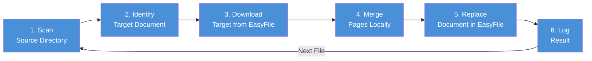
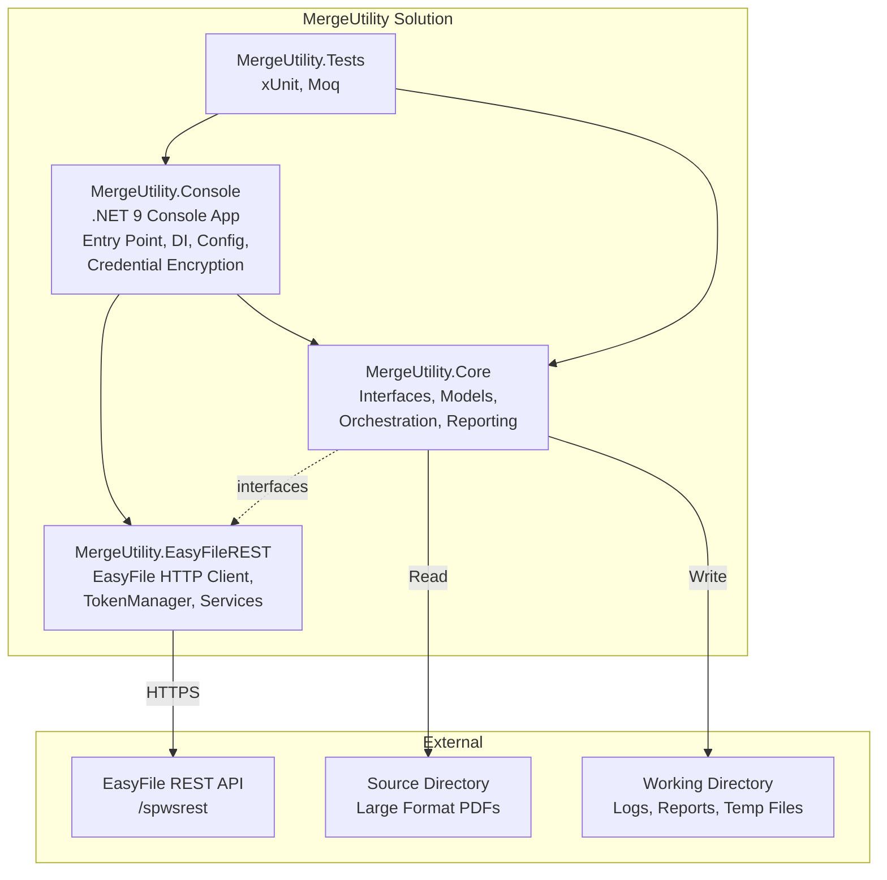
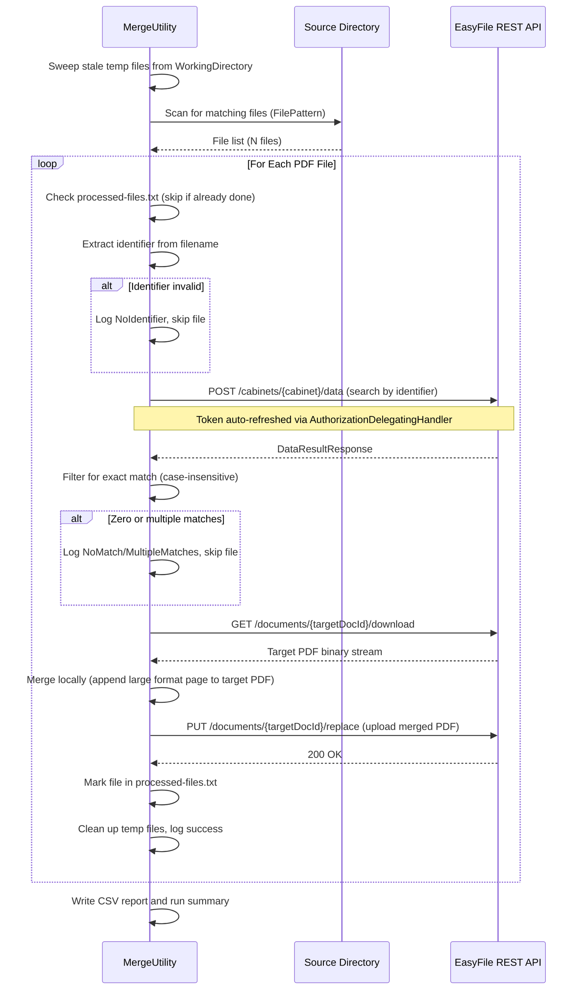

# Large Format Document Merge Utility — Technical Design Document

| Field | Value |
|-------|-------|
| **Title** | Large Format Document Merge Utility |
| **Date** | 2026-03-17 |
| **Authors** | Aric Malsbury |
| **Reviewers** | Michael Drew (Approver), Bill Cross (EasyFile Product Lead) |

### Revision History

| Version | Date | Author | Description |
|---------|------|--------|-------------|
| 1.0 | 2026-03-17 | Aric Malsbury | Initial Commit |
| 1.1 | 2026-03-18 | Aric Malsbury | Resolved filename convention and key value matching; assigned developer (Aric Malsbury); updated dev estimate to 1 hour |
| 1.2 | 2026-03-23 | Aric Malsbury | Updated to reflect implemented codebase: renamed MergeUtility.Api to MergeUtility.EasyFileREST; replaced Serilog with built-in logging; replaced Newtonsoft.Json with System.Text.Json; added DPAPI credential encryption; added processed-file tracking; added CLI modes; resolved open items #3 and #4 |

---

## 1. Executive Summary

### Problem

The City of Fair Oaks project (and similar future projects) contains approximately **5,000 large format single-page PDF documents** that must be merged into their corresponding standard documents already housed in EasyFile. The client requires all documents to be reviewable within EasyFile via the validation server.

Manual insertion was evaluated and **rejected** — it would require an estimated **14,560+ hours** of labor and does not scale to future projects.

### Solution

A custom **.NET 9 utility** that automates the merge process by:

1. Reading large format PDFs from a shared directory
2. Identifying which EasyFile document each PDF belongs to by matching the key value in the filename (e.g., `[keyvalue]_LF001.pdf`) to the key value index field on the standard document in EasyFile
3. Downloading the target document, merging the pages locally, and replacing the document in EasyFile
4. Logging all results for audit and review

This utility integrates with **EasyFile's existing REST API** — no new API development is required.

### Outcome

Once built and approved, this utility becomes the **standard, repeatable tool** for all future large format document merge projects, eliminating manual effort entirely.

---

## 2. How It Works



**For each large format PDF file, the utility:**

| Step | What Happens | If It Fails |
|------|-------------|-------------|
| **Scan** | Reads PDF files from a configured network directory | Utility exits if directory is inaccessible |
| **Identify** | Extracts the key value from the filename (e.g., the key value portion of `[keyvalue]_LF001.pdf`) and searches EasyFile for a standard document with a matching key value index field | Logs the error, skips the file, continues |
| **Download** | Downloads the matching target document from EasyFile | Retries up to 3 times, then skips |
| **Merge** | Appends the large format page to the end of the target PDF locally | Logs the error, skips the file, continues |
| **Replace** | Uploads the merged PDF back to EasyFile, replacing the original | Retries up to 3 times, then skips |
| **Log** | Records success or failure with details | Always logged |

**The utility never stops on individual failures.** It processes every file and produces a complete report at the end.

---

## 3. Key Design Decisions

| Decision | What We Chose | Why | Alternative Considered |
|----------|--------------|-----|----------------------|
| **Merge approach** | Download target, merge locally, re-upload | Proven approach using well-understood tools; does not depend on unvalidated API behavior | EasyFile's server-side `combine` endpoint — deferred as a future optimization once validated |
| **Application type** | .NET 9 console application | Simple to deploy, schedule, and run on-demand via Windows Task Scheduler; no server infrastructure needed | Windows Service or web app — unnecessary complexity for a batch job |
| **File identification** | Configurable regex pattern on filename — extracts the key value from `[keyvalue]_LF001.pdf` and matches it to the key value index field on the standard document in EasyFile | Flexible; adapts to different naming conventions across projects without code changes | Hardcoded parsing — fragile, requires code changes per project |
| **Error strategy** | Log and skip failures, never halt | Maximizes throughput; a single bad file should not block 4,999 good ones | Halt on first error — unacceptable for batch processing |
| **EasyFile integration** | REST API (existing endpoints) | No API development needed; uses existing search, download, and replace capabilities | Direct database access — rejected for security and supportability reasons |
| **JSON serialization** | `System.Text.Json` | Built-in, no extra dependency, better performance | `Newtonsoft.Json` — unnecessary third-party dependency for this use case |
| **Logging** | Built-in `Microsoft.Extensions.Logging` with custom file provider | Zero third-party dependencies; logs written to WorkingDirectory for co-location with reports | Serilog — removed to reduce dependency footprint |
| **Credential protection** | Windows DPAPI (`ProtectedData`) with `--encrypt-keys` CLI | Machine-level encryption at rest; no plaintext secrets in config files | Azure Key Vault — overkill for a local batch utility |
| **Re-run safety** | Persistent processed-file log (`processed-files.txt`) | Simple, file-based; survives restarts; prevents duplicate page insertion | Move files to completed folder — riskier if source directory is shared |

---

## 4. What Gets Produced Each Run

The utility generates three outputs after every run:

### Run Summary (console and log file)

```
Run complete. Total: 5012 | Skipped: 0 | Success: 4891 | Failed: 121
```

### Detailed CSV Report

A row-by-row log of every file processed (`merge-report.csv` in WorkingDirectory), with status, target document ID, error details (if any), and processing time. This can be opened in Excel for review or filtering. A run summary section is appended at the bottom.

### Log File

Daily rolling log file (`merge-{yyyyMMdd}.log` in WorkingDirectory/logs/) with timestamped entries for every operation performed.

---

## 5. Open Items Requiring Action

| # | Item | Who Owns It | Status | Impact if Unresolved |
|---|------|------------|--------|---------------------|
| 1 | ~~Confirm the **filename convention** for City of Fair Oaks large format files~~ | Justin Shee | **Resolved** | Filename convention confirmed: `[keyvalue]_LF001.pdf`, `[keyvalue]_LF002.pdf`, etc. The key value in the filename matches a key value index field on the corresponding standard document in EasyFile. |
| 2 | ~~Confirm which **EasyFile cabinet field** the identifier maps to~~ | Project Team | **Resolved** | The identifier maps to the key value index field on the standard document. The utility searches EasyFile for a standard document whose key value index field matches the key value extracted from the large format filename. |
| 3 | ~~Decide **re-run safety strategy** — how to prevent duplicate processing if the utility is run twice on the same files~~ | Aric Malsbury | **Resolved** | Implemented `ProcessedFileLog` — a persistent `processed-files.txt` file in the WorkingDirectory. On each run, previously processed files are skipped automatically. The log can be cleared to force reprocessing. |
| 4 | ~~Confirm **performance expectations** — estimated 3-5 seconds per file, or roughly 4-7 hours for 5,000 files~~ | Aric Malsbury | **Resolved** | Confirmed via test runs. Performance is within expected range. |

### Future Enhancement (Deferred)

The EasyFile API exposes a server-side `combine` endpoint that could merge documents without downloading them first. This could reduce processing time and bandwidth. It has been deferred for future validation and is documented as an optimization opportunity.

---

## 6. Risks

| Risk | Likelihood | Impact | Mitigation |
|------|-----------|--------|------------|
| EasyFile API is unavailable during a run | Low | Medium | Automatic retries with exponential backoff; utility can be re-run for failed files |
| Filename convention changes between projects | Medium | Low | Identifier pattern is configurable — no code changes needed |
| ~~Duplicate processing on re-run~~ | ~~Medium~~ | ~~Medium~~ | **Mitigated** — `ProcessedFileLog` tracks completed files; duplicates are skipped automatically |
| Large file sizes cause timeouts | Low | Low | Extended timeouts for download/replace operations (120 seconds) |
| API credentials expire or are revoked | Low | High | Token auto-refresh; clear error message if authentication fails; `--test-connection` mode for pre-flight check |

---

## 7. Estimated Effort

| Item | Estimate | Notes |
|------|----------|-------|
| Development | ~1 hour | Leveraging Claude/AI assistance and existing EasyFile API client patterns |
| Developer | Aric Malsbury | Assigned |
| Testing | Included | Unit tests (31 passing) + staging validation with ~10 files before production use |
| Deployment | Minimal | Single executable, runs on any Windows machine with .NET 9 |

This estimate has been reviewed and confirmed by the assigned developer.

---

## 8. Assumptions

1. The EasyFile REST API is available and stable during utility execution.
2. API credentials (OAuth2 client credentials and API key) are provisioned for the utility's service account.
3. The service account has permissions to search, download, and replace documents in the target cabinet.
4. All large format PDFs in the source directory are valid, single-page PDF files.
5. Each large format PDF maps to exactly one target document in EasyFile. Multiple large format pages may map to the same target (many-to-one), but a single large format page never maps to multiple targets.
6. Large format pages are always appended at the end of the target document.
7. The identifier embedded in the filename is sufficient to uniquely locate the target document.

---

## 9. Approval

| Role | Name | Signature | Date |
|------|------|-----------|------|
| Technical Lead | Will Cross | | |
| Developer | Aric Malsbury | | |
| Project Manager | Justin Shee | | |
| Approver | Michael Drew | | |

**Development work shall not begin until all signatures above are obtained, as specified in the original business specification.**

If the City of Fair Oaks has an imminent delivery deadline that cannot accommodate the build timeline, the manual insertion process (performed by an indexer using EasyFile's built-in insert feature) will be used for Fair Oaks only. The utility build will still proceed for future projects.

---
---

# Technical Appendix

*The sections below provide implementation details for the development team. Executive reviewers may skip this appendix.*

---

## A. Architecture Overview

### A.1 Component Diagram



**Dependency direction:** `Core` defines interfaces (`IDocumentSource`, `ICabinetService`, `ITokenManager`). `EasyFileREST` implements them. `Console` wires everything together via DI. This ensures `Core` has no dependency on HTTP/API concerns.

### A.2 Processing Sequence



---

## B. Project Structure

```
MergeUtility.slnx
├── src/
│   ├── MergeUtility.Console/           # .NET 9 Console App (net9.0-windows)
│   │   ├── Program.cs                  # Host builder, DI, logging, entry point
│   │   ├── MergeWorker.cs              # BackgroundService — runs merge orchestrator
│   │   ├── ConnectionTestWorker.cs     # BackgroundService — tests API connectivity
│   │   ├── EncryptKeysCommand.cs       # CLI: --encrypt-keys
│   │   ├── EncryptionHelper.cs         # Windows DPAPI encrypt/decrypt
│   │   ├── DecryptEasyFileApiOptions.cs # IConfigureOptions — decrypts credentials at startup
│   │   ├── FileLoggerProvider.cs       # Custom daily rolling file logger
│   │   ├── appsettings.json            # Configuration
│   │   ├── appsettings.Development.json
│   │   └── MergeUtility.Console.csproj
│   ├── MergeUtility.Core/              # Business Logic (net9.0)
│   │   ├── Interfaces/
│   │   │   ├── IMergeOrchestrator.cs
│   │   │   ├── IMergeProcessor.cs
│   │   │   ├── IFileScanner.cs
│   │   │   ├── IIdentifierExtractor.cs
│   │   │   ├── IPdfMergeService.cs
│   │   │   ├── IReportGenerator.cs
│   │   │   ├── IDocumentSource.cs      # Download/Replace operations
│   │   │   ├── ICabinetService.cs      # Cabinet search operations
│   │   │   └── ITokenManager.cs        # Token lifecycle
│   │   ├── Models/
│   │   │   ├── ApiResponse.cs          # Generic API response wrapper
│   │   │   ├── DataResultResponse.cs   # Cabinet search result
│   │   │   ├── MergeStatus.cs          # Status enum (8 values)
│   │   │   ├── PdfFileInfo.cs
│   │   │   ├── ProcessingRecord.cs     # Per-file result (record type)
│   │   │   ├── RunSummary.cs
│   │   │   └── Configuration/
│   │   │       ├── EasyFileApiOptions.cs
│   │   │       ├── MergeOptions.cs
│   │   │       └── RetryPolicyOptions.cs
│   │   ├── Services/
│   │   │   ├── MergeOrchestrator.cs    # Main pipeline loop
│   │   │   ├── MergeProcessor.cs       # Single-file processing
│   │   │   ├── FileScanner.cs          # Directory enumeration
│   │   │   ├── RegexIdentifierExtractor.cs
│   │   │   ├── PdfMergeService.cs      # PdfSharpCore merge
│   │   │   ├── CsvReportGenerator.cs   # CSV report with CsvHelper
│   │   │   └── ProcessedFileLog.cs     # Re-run safety tracking
│   │   └── MergeUtility.Core.csproj
│   └── MergeUtility.EasyFileREST/      # EasyFile API Client (net9.0)
│       ├── TokenManager.cs             # OAuth2 token lifecycle
│       ├── AuthorizationDelegatingHandler.cs # Auto-attach Bearer + headers, 401 retry
│       ├── BaseEasyFileService.cs      # Shared GET/POST helpers
│       ├── DocumentService.cs          # IDocumentSource: download, replace
│       ├── CabinetService.cs           # ICabinetService: search
│       ├── ApiErrorHelper.cs           # Error response parsing
│       ├── Models/
│       │   ├── TokenResponse.cs
│       │   ├── FetchCabinetDataRequest.cs
│       │   ├── DocumentUploadResponse.cs
│       │   └── Attr.cs
│       └── MergeUtility.EasyFileREST.csproj
└── tests/
    └── MergeUtility.Tests/             # Unit Tests (net9.0-windows)
        ├── IdentifierExtractorTests.cs
        ├── MergeProcessorTests.cs
        ├── MergeOrchestratorTests.cs
        ├── FileScannerTests.cs
        ├── EncryptionHelperTests.cs
        └── MergeUtility.Tests.csproj
```

**Rationale for Console App:** This is a batch processing utility run on-demand or via Windows Task Scheduler. It does not need to be a long-running service or web API. A console app provides the simplest deployment model with full DI support via `Microsoft.Extensions.Hosting`.

---

## C. Key Components

| Component | Interface | Responsibility |
|-----------|-----------|----------------|
| **MergeOrchestrator** | `IMergeOrchestrator` | Main pipeline loop: sweep temp dir, scan, process each file, generate report |
| **MergeProcessor** | `IMergeProcessor` | Single-file processing: search, download, merge, replace |
| **FileScanner** | `IFileScanner` | Enumerate PDFs in source directory matching `FilePattern` |
| **RegexIdentifierExtractor** | `IIdentifierExtractor` | Parse filename with configurable regex, return identifier string |
| **PdfMergeService** | `IPdfMergeService` | Local PDF merge: append pages using PdfSharpCore |
| **CsvReportGenerator** | `IReportGenerator` | Write structured CSV log and run summary |
| **ProcessedFileLog** | (concrete) | Track processed files in `processed-files.txt` to prevent duplicates |
| **TokenManager** | `ITokenManager` | OAuth2 token lifecycle (login, proactive refresh, expiry check) |
| **AuthorizationDelegatingHandler** | (DelegatingHandler) | Attach Bearer token + custom headers; auto-retry on 401 |
| **DocumentService** | `IDocumentSource` | Download and replace documents via EasyFile API |
| **CabinetService** | `ICabinetService` | Search cabinet data via EasyFile API |
| **EncryptionHelper** | (static) | Windows DPAPI encrypt/decrypt for credentials |
| **FileLoggerProvider** | `ILoggerProvider` | Daily rolling log files in WorkingDirectory/logs/ |

---

## D. Processing Pipeline Detail

The utility executes in five sequential phases:

**Phase 1 — Startup**
- Load configuration from `appsettings.json`
- Decrypt `ApiKey` and `ClientSecret` via DPAPI (`DecryptEasyFileApiOptions`)
- Configure logging (console + daily rolling file in WorkingDirectory/logs/)
- Build DI container via `Host.CreateDefaultBuilder()`
- Launch `MergeWorker` (or `ConnectionTestWorker` if `--test-connection`)

**Phase 2 — Preparation**
- Sweep stale `.pdf` temp files from WorkingDirectory
- Load `processed-files.txt` to skip already-processed files

**Phase 3 — Discovery**
- Scan configured source directory for files matching `FilePattern`
- Log total file count
- If zero files found: log info, exit cleanly

**Phase 4 — Processing (per file)**

```csharp
foreach (var file in files)
{
    if (_processedFileLog.IsProcessed(file.FileName))
    {
        _logger.LogInformation("[Skipped] {File} — already processed", file.FileName);
        summary.Skipped++;
        continue;
    }

    var record = await _mergeProcessor.ProcessAsync(file, ct);
    summary.Tally(record.Status);

    if (record.Status == MergeStatus.Success)
        await _processedFileLog.MarkProcessedAsync(file.FileName);

    await _reportGenerator.WriteRecordAsync(record);
}
```

Inside `MergeProcessor.ProcessAsync()`:
1. Extract identifier from filename via `IIdentifierExtractor`
2. Search EasyFile: `POST /api/v1/cabinets/{cabinet}/data` with extracted identifier
3. Filter results for exact case-insensitive match on the search field
4. Validate exactly one match
5. Download the target document: `GET /api/v1/documents/{targetDocId}/download`
6. Merge locally: append the large format PDF to the downloaded target PDF
7. Replace the target document: `PUT /api/v1/documents/{targetDocId}/replace`
8. Clean up local temporary files (in `finally` block)
9. Return `ProcessingRecord` with status and timing

**Phase 5 — Reporting**
- Write run summary to CSV and log
- Exit cleanly

---

## E. Configuration Schema

```json
{
  "EasyFileApi": {
    "BaseUrl": "https://host/spwsrest",
    "AuthBaseUrl": "https://host/spwsrestauth",
    "ApiKey": "ENC:base64...",
    "ClientId": "your-client-id",
    "ClientSecret": "ENC:base64...",
    "ProfileKey": "easyfile",
    "LoggedInUser": "merge-utility-svc",
    "CallingApp": "MergeUtility"
  },
  "MergeOptions": {
    "SourceDirectory": "\\\\server\\share\\LargeFormat",
    "CabinetName": "FT_FAIROAKS",
    "SearchFieldName": "Key Value",
    "IdentifierRegex": "^(.+?)_LF\\d+",
    "WorkingDirectory": "C:\\ProgramData\\CASO Document Management\\MergeUtility\\WorkingDir",
    "FilePattern": "*LF*.pdf"
  },
  "RetryPolicy": {
    "MaxRetries": 3,
    "BaseDelaySeconds": 2
  }
}
```

| Setting | Description |
|---------|-------------|
| `EasyFileApi.BaseUrl` | EasyFile REST API base URL (includes `/spwsrest`) |
| `EasyFileApi.AuthBaseUrl` | OAuth2 token endpoint base URL |
| `EasyFileApi.ApiKey` | API key — encrypted at rest with `ENC:` prefix (DPAPI) |
| `EasyFileApi.ClientSecret` | Client secret — encrypted at rest with `ENC:` prefix (DPAPI) |
| `EasyFileApi.LoggedInUser` | Service account username for `X-Logged-In-User` header |
| `EasyFileApi.CallingApp` | Application identifier for `X-Calling-App` header |
| `MergeOptions.SourceDirectory` | Path to directory containing large format PDFs |
| `MergeOptions.CabinetName` | Target EasyFile cabinet (e.g., `FT_FAIROAKS`) |
| `MergeOptions.SearchFieldName` | Cabinet field to search on (e.g., `Key Value`) |
| `MergeOptions.IdentifierRegex` | Regex with first capture group extracting the identifier |
| `MergeOptions.WorkingDirectory` | Directory for temp files, logs, reports, and processed-file tracking |
| `MergeOptions.FilePattern` | Glob pattern for source file matching (default: `*LF*.pdf`) |
| `RetryPolicy.MaxRetries` | Number of retry attempts for transient HTTP failures |
| `RetryPolicy.BaseDelaySeconds` | Base delay for exponential backoff |

---

## F. EasyFile REST API Integration

### F.1 Authentication Flow

The utility authenticates using the OAuth2 client credentials grant. The `TokenManager` handles the full token lifecycle — login, proactive refresh, and thread-safe access.

```
POST {AuthBaseUrl}/api/v1/OAuth2/token
Content-Type: text/plain

grant_type=client_credentials&client_id={ClientId}&client_secret={ClientSecret}&profile_key={ProfileKey}
```

**Response:**
```json
{
  "access_token": "eyJhbG...",
  "refresh_token": "abc123...",
  "expires_in": "2026-03-17T18:00:00Z"
}
```

**Note:** `expires_in` is an ISO 8601 datetime (not a duration in seconds). The `TokenManager` stores this as a `DateTime` and proactively refreshes when the current time is within 5 minutes of expiry.

The `AuthorizationDelegatingHandler` transparently attaches the Bearer token, `X-Logged-In-User`, and `X-Calling-App` headers to every API request. On HTTP 401, it invalidates the token, re-authenticates, and retries the request once.

### F.2 Endpoint Usage

| Operation | Method | Endpoint | Key Parameters |
|-----------|--------|----------|----------------|
| Search by identifier | POST | `/api/v1/cabinets/{cabinetName}/data` | Body: `FetchCabinetDataRequest` with `searchKey`, `searchText` |
| Download target document | GET | `/api/v1/documents/{targetDocId}/download` | Path: `targetDocId`; returns binary stream; 120s timeout |
| Replace target document | PUT | `/api/v1/documents/{targetDocId}/replace` | Multipart with file, userId, comments; 120s timeout |

### F.3 Request/Response Models

**Search Request — `FetchCabinetDataRequest`:**
```json
{
  "userId": "merge-utility-svc",
  "start": 0,
  "length": 200,
  "searchKey": "Key Value",
  "searchText": "01-11234",
  "orderBy": "",
  "orderDir": "asc"
}
```

**Search Response — `DataResultResponse`:**
```json
{
  "data": [{ "docID": 42857, "Key Value": "01-11234", ... }],
  "totalCount": 1
}
```

**Important:** The cabinet search endpoint may return partial matches. The utility performs an additional **exact, case-insensitive match** on the `SearchFieldName` field client-side to ensure only exact matches are processed.

**Download Response:**
The `GET /documents/{id}/download` endpoint returns the document as a binary file stream with `Content-Type` and `Content-Disposition` headers. The utility saves this to a GUID-named temp file in the WorkingDirectory.

**Replace Request:**
The `PUT /documents/{targetDocId}/replace` endpoint accepts multipart form data with the merged PDF file, userId, and comments.

### F.4 API Error Handling

Every EasyFile API response uses a standard wrapper:
```json
{ "success": true, "message": "...", "data": { } }
```

The utility checks **both** the HTTP status code and the `success` field — an HTTP 200 can return `"success": false`.

```csharp
// Dual-check pattern used in BaseEasyFileService.HandleResponse<T>()
if (!response.IsSuccessStatusCode)
{
    var errorMsg = ApiErrorHelper.ParseErrorResponse(response, content);
    throw new HttpRequestException(errorMsg, null, response.StatusCode);
}

var result = JsonSerializer.Deserialize<ApiResponse<T>>(content, _jsonOptions);
if (result is null || !result.Success)
    throw new HttpRequestException(result?.Message ?? "API returned failure");
```

---

## G. File Processing

### G.1 Directory Scanning

The `FileScanner` enumerates files in the configured source directory:

```csharp
Directory.EnumerateFiles(
    options.SourceDirectory,
    options.FilePattern,       // default: "*LF*.pdf"
    SearchOption.TopDirectoryOnly);
```

If the source directory does not exist, a `DirectoryNotFoundException` is thrown and the utility exits.

### G.2 Identifier Extraction

The `RegexIdentifierExtractor` uses a configurable regular expression to parse the document identifier from each filename. The first capture group is treated as the identifier. The regex is compiled and case-insensitive.

**Confirmed filename convention:** Large format files follow the pattern `[keyvalue]_LF001.pdf`, `[keyvalue]_LF002.pdf`, etc. The key value extracted from the filename matches the key value index field on the corresponding standard document in EasyFile.

**Example:** The default regex `^(.+?)_LF\d+` extracts the key value from filenames like:
- `01-11234_LF001.pdf` → key value `01-11234`
- `01-11234_LF002.pdf` → key value `01-11234`
- `PROJ-5678_LF001.pdf` → key value `PROJ-5678`

If the regex produces no match, the file is logged as a `NoIdentifier` status and skipped.

---

## H. Logging and Reporting

### H.1 Logging

The utility uses `Microsoft.Extensions.Logging` with two providers:

- **Console provider** — Real-time progress during execution
- **FileLoggerProvider** — Daily rolling log files in `WorkingDirectory/logs/`, named `merge-{yyyyMMdd}.log`

Log entries include timestamp, level, source context, and message:
```
2026-03-23 19:50:39.466 [INF] MergeOrchestrator: Starting merge run. Source: C:\Projects\LFImport
2026-03-23 19:50:39.476 [INF] MergeOrchestrator: Found 1 file(s) to process
2026-03-23 19:50:40.321 [ERR] MergeProcessor: HTTP error processing ABC_123_LF001.pdf at step Error
2026-03-23 19:50:40.363 [INF] MergeOrchestrator: Run complete. Total: 1 | Skipped: 0 | Success: 0 | Failed: 1
```

### H.2 CSV Results Log

Every file processed generates a row in `merge-report.csv` (in WorkingDirectory):

| Column | Description |
|--------|-------------|
| `Timestamp` | ISO 8601 timestamp of processing |
| `FileName` | Source PDF filename |
| `Identifier` | Extracted identifier (or empty) |
| `TargetDocId` | EasyFile document ID of target (or empty) |
| `Status` | `Success`, `NoIdentifier`, `NoMatch`, `MultipleMatches`, `DownloadFailed`, `MergeFailed`, `ReplaceFailed`, `Error` |
| `ErrorMessage` | Error details (empty on success) |
| `DurationMs` | Processing time in milliseconds |

A run summary section is appended at the bottom with totals for each status category.

### H.3 Processed File Log

The `ProcessedFileLog` maintains a persistent `processed-files.txt` in the WorkingDirectory. After each successful merge, the filename is appended. On subsequent runs, files already in this log are skipped. This prevents duplicate page insertion when the utility is re-run.

---

## I. Error Handling and Resilience

### I.1 Exception Scenarios

| Scenario | Detection | Behavior | Retry? |
|----------|-----------|----------|--------|
| File name has no parseable identifier | Regex no match | Log, skip | No |
| Zero matching documents in EasyFile | Exact match filter returns 0 | Log, skip | No |
| Multiple documents match identifier | Exact match filter returns >1 | Log, skip | No |
| Download target fails (HTTP 5xx) | HTTP status code | Log, retry per policy | Yes (3x) |
| Download target fails (HTTP 4xx) | HTTP status code | Log, skip | No |
| Local PDF merge fails | Exception from PdfSharpCore | Log, skip | No |
| Replace/re-upload fails | HTTP status or `success: false` | Log, retry per policy | Yes (3x) |
| Auth token expired mid-run | HTTP 401 | Auto-refresh via handler, retry | Yes (auto) |
| Network timeout | `TaskCanceledException` | Log, retry per policy | Yes (3x) |
| Source file locked/inaccessible | `IOException` | Log, skip | No |
| EasyFile API down | HTTP 503 or connection refused | Log, retry, then skip | Yes (3x) |
| Unexpected exception | `Exception` | Log full stack trace, skip | No |

### I.2 Resilience Pipeline

Resilience is configured via `Microsoft.Extensions.Http.Resilience` (`AddStandardResilienceHandler`) on both Document and Cabinet HTTP clients:

- **Transient HTTP errors** (5xx, 408, network failures): Exponential backoff — 3 retries at 2s, 4s, 8s intervals
- **HTTP 401**: Single retry after token refresh (handled by `AuthorizationDelegatingHandler`)
- **Timeout**: 120 seconds for download and replace operations (via linked `CancellationTokenSource`)

### I.3 Never-Halt Guarantee

The utility never halts on individual file failures. `MergeProcessor.ProcessAsync()` catches all exceptions internally and returns a `ProcessingRecord` with the appropriate `MergeStatus`. The orchestrator tallies results and always continues to the next file.

The **only conditions that halt the utility** are:
- Source directory does not exist (no files to process)
- Unrecoverable host-level exception (out of memory, etc.)

---

## J. Security Considerations

| Concern | Approach |
|---------|----------|
| **Credentials at rest** | `ApiKey` and `ClientSecret` encrypted with Windows DPAPI (`DataProtectionScope.LocalMachine`). Encrypted values prefixed with `ENC:` in `appsettings.json`. Use `--encrypt-keys` to encrypt after initial setup. |
| **No plaintext secrets in source control** | Credential fields are empty in committed `appsettings.json`; `.gitignore` excludes local settings |
| **Token handling** | Access and refresh tokens are held in memory only, never written to logs or disk |
| **Transport security** | All API calls use HTTPS |
| **Audit trail** | Every API request includes `X-Logged-In-User` and `X-Calling-App` headers |
| **File access** | Utility runs under a service account with read access to source directory, write access to WorkingDirectory |
| **Log sensitivity** | File names and identifiers are logged; document content and credentials are never logged |

---

## K. Testing Strategy

### K.1 Unit Tests (31 tests, all passing)

| Test Class | Covers |
|-----------|--------|
| `IdentifierExtractorTests` | Valid filenames, edge cases (no match, multiple formats, special characters) |
| `MergeProcessorTests` | All processing paths: success, no identifier, no match, multiple matches, download failure, merge failure, replace failure |
| `MergeOrchestratorTests` | Orchestration: zero files, mixed success/failure, skip already-processed, summary generation |
| `FileScannerTests` | Directory enumeration, empty directory, file filtering |
| `EncryptionHelperTests` | Encryption round-trip, `ENC:` prefix detection |

API interactions are mocked using `Moq`. Each error path in the exception table (Section I.1) has a corresponding test case.

### K.2 Integration Tests

Run against a staging EasyFile instance:
- Download a target document, merge a test large format page locally, replace the target, verify page count via `GET /documents/{id}/info`
- Verify audit trail entries are created
- Test token refresh by using an expired token

### K.3 Manual Validation

Before production use:
1. Run `--test-connection` to verify API credentials and connectivity
2. Run with a subset of ~10 large format PDFs in a staging cabinet
3. Open each merged document in the EasyFile viewer to visually confirm the large format page is appended at the end
4. Review the CSV report for accuracy
5. Verify the run summary counts match expectations

See `docs/MergeUtility-Test-Checklist.docx` for the full manual test checklist.

---

## L. Deployment and Operations

### L.1 Build

```bash
dotnet publish src/MergeUtility.Console -c Release -r win-x64 --self-contained false
```

**Prerequisites on target machine:**
- .NET 9 runtime (Windows)
- Network access to EasyFile REST API endpoint
- Read access to source PDF directory
- Write access to WorkingDirectory (`C:\ProgramData\CASO Document Management\MergeUtility\WorkingDir`)

### L.2 Execution

```bash
# Test connectivity before first run
MergeUtility.Console.exe --test-connection

# Encrypt API credentials (first-time setup)
MergeUtility.Console.exe --encrypt-keys

# Run the merge utility
MergeUtility.Console.exe

# Or schedule via Windows Task Scheduler
```

### L.3 CLI Modes

| Flag | Behavior |
|------|----------|
| *(none)* | Run the full merge pipeline |
| `--test-connection` | Authenticate with EasyFile and display token info; exit |
| `--encrypt-keys` | Encrypt `ApiKey` and `ClientSecret` in `appsettings.json` using DPAPI; exit |

### L.4 Re-Run Safety

Implemented via `ProcessedFileLog`. After each successful merge, the filename is appended to `processed-files.txt` in the WorkingDirectory. On subsequent runs, these files are automatically skipped. To force reprocessing, delete the relevant entries from (or the entire) `processed-files.txt` file.

### L.5 Output Locations

All runtime output is written to the configured `WorkingDirectory`:

| File | Location | Description |
|------|----------|-------------|
| Log files | `WorkingDirectory/logs/merge-{yyyyMMdd}.log` | Daily rolling application logs |
| CSV report | `WorkingDirectory/merge-report.csv` | Per-file processing results |
| Processed log | `WorkingDirectory/processed-files.txt` | Re-run safety tracking |
| Temp files | `WorkingDirectory/base_*.pdf`, `merge_*.pdf` | Cleaned up after each file |

---

## M. Dependencies (NuGet Packages)

### MergeUtility.Console

| Package | Version | Purpose |
|---------|---------|---------|
| `Microsoft.Extensions.Hosting` | 9.x | Generic host, DI, configuration |
| `Microsoft.Extensions.Http.Resilience` | 9.x | Standard resilience pipeline (retry, circuit breaker, timeout) |
| `System.Security.Cryptography.ProtectedData` | 9.x | Windows DPAPI for credential encryption |

### MergeUtility.Core

| Package | Version | Purpose |
|---------|---------|---------|
| `PdfSharpCore` | 1.3.x | Local PDF merge operations (append pages) |
| `CsvHelper` | 33.x | CSV report generation |
| `Microsoft.Extensions.Logging.Abstractions` | 9.x | `ILogger<T>` interface |
| `Microsoft.Extensions.Options` | 9.x | Options pattern (`IOptions<T>`) |

### MergeUtility.EasyFileREST

| Package | Version | Purpose |
|---------|---------|---------|
| `Microsoft.Extensions.Http` | 9.x | `IHttpClientFactory` for managed HTTP clients |
| `Microsoft.Extensions.Http.Resilience` | 9.x | Standard resilience pipeline |
| `System.Text.Json` | 9.x | JSON serialization/deserialization |

### Test Only

| Package | Version | Purpose |
|---------|---------|---------|
| `xunit` | 2.9.x | Test framework |
| `xunit.runner.visualstudio` | 2.x | VS Test Explorer integration |
| `Moq` | 4.x | Mocking framework |
| `FluentAssertions` | 7.x | Fluent test assertions |
| `Microsoft.NET.Test.Sdk` | 17.x | Test host |
| `coverlet.collector` | 6.x | Code coverage |

---

## References

- Original Specification: `Materials/Large Format Document Merge Utility – Technical Specification.pdf`
- EasyFile REST API Skill: `.claude/skills/easyfile-rest-api/SKILL.md`
- EasyFile Endpoint Reference: `.claude/skills/easyfile-rest-api/references/endpoints.md`
- EasyFile Client Integration Guide: `.claude/skills/easyfile-rest-api/references/client-integration.md`
- Manual Test Checklist: `docs/MergeUtility-Test-Checklist.docx`
